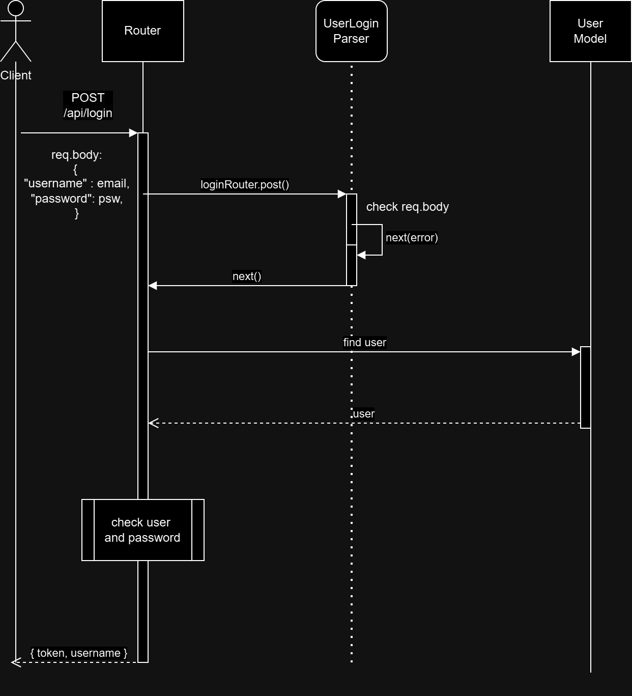
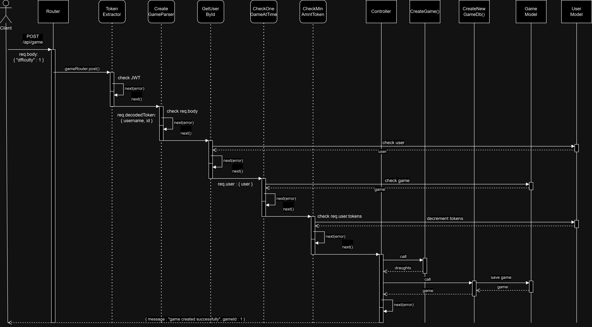
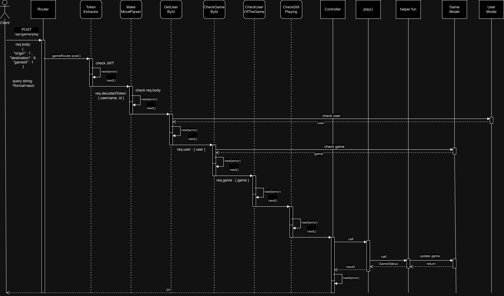
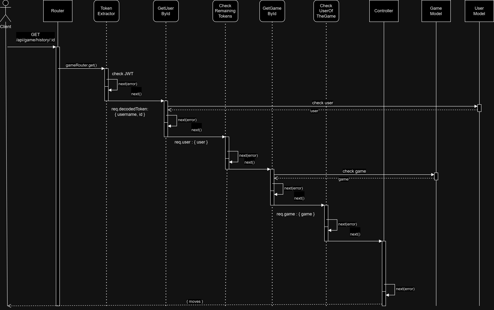
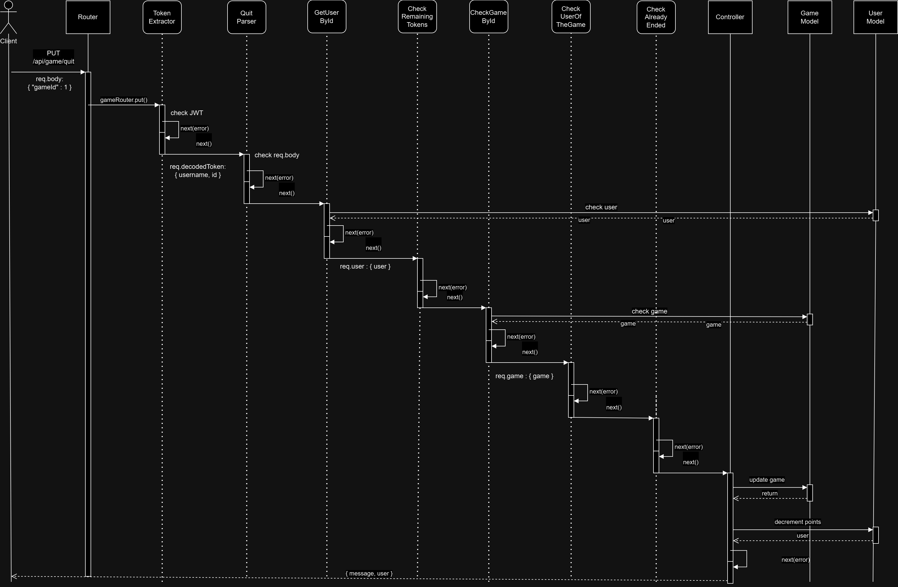
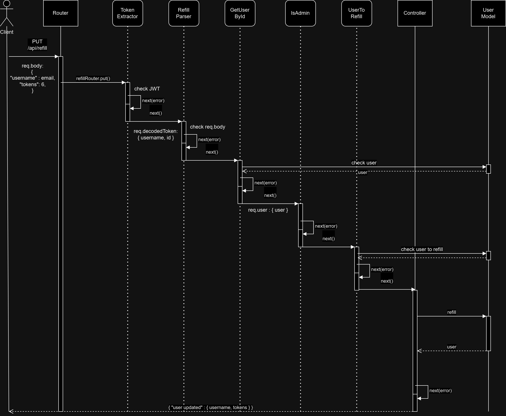

# PROGRAMMAZIONE AVANZATA

## 0 - OBIETTIVI DEL PROGETTO

### 0.1 - Specifiche Esame
La consegna dell'esame è contenuta all'interno del file Word.

### 0.2 - Dama Inglese
Si riportano dei richiami sulle caratteristiche della dama inglese al fine di permettere un totale coinvolgimento dell'utente durante la partita:
- Scacchiera e Pezzi: La dama inglese si gioca su una scacchiera 8x8 con 12 pezzi per ciascun giocatore, di solito di colore bianco (IA) e nero (utente). I pezzi possono muoversi solo sulle caselle scure.
- Obiettivo: L'obiettivo del gioco è catturare tutti i pezzi dell'avversario o bloccare le sue mosse in modo che non possa più muoversi.
- Movimento e Cattura: I pezzi si muovono diagonalmente in avanti di una casella vuota per volta. Quando un pezzo può "saltare" su uno dell'avversario, lo cattura obbligatoriamente (mangiare è obbligatorio). Il salto avviene in modo diagonale e il pezzo avversario deve essere immediatamente dietro il proprio.
- Promozione a Re: Quando un pezzo raggiunge il lato opposto della scacchiera, viene promosso a "re". I re possono muoversi e catturare sia in avanti sia indietro.
- Fine del Gioco: Il gioco termina quando un giocatore cattura tutti i pezzi avversari, blocca tutte le sue mosse, oppure l'avversario si arrende. In mancanza di mosse per entrambi, si dichiara un pareggio.

Il progetto prevede l'utilizzo della liberia <a href="https://github.com/loks0n/rapid-draughts">rapid-draughts</a>.

#### Rappresentazione della scacchiera
La scacchiera è disegnata in modo tale che solo le caselle nere, le uniche occupabili, abbiano un numero che le rappresenti; quindi, per effettuare una mossa si specifica la casella di origine e quella di destinazione indicando rispettivamente i propri numeri.

|    |  0  |    |  1  |    |  2  |    |  3  |
|----|-----|----|-----|----|-----|----|-----|
|  4 |     |  5 |     |  6 |     |  7 |     |
|    |  8  |    |  9  |    |  10 |    |  11 |
|  12|     |  13|     |  14|     |  15|     |
|    |  16 |    |  17 |    |  18 |    |  19 |
|  20|     |  21|     |  22|     |  23|     |
|    |  24 |    |  25 |    |  26 |    |  27 |
|  28|     |  29|     |  30|     |  31|     |

#### Rappresentazione delle pedine
Il giocatore si vedrà assegnata la prima mossa del gioco con le pedine nere a forma di cerchio (in alto nella scacchiera). La disposizione di partenza delle pedine è rappresentata nella seguente figura.

|    |  o  |    |  o  |    |  o  |    |  o  |
|----|-----|----|-----|----|-----|----|-----|
|  o |     |  o |     |  o |     |  o |     |
|    |  o  |    |  o  |    |  o  |    |  o  |
|  12|     |  13|     |  14|     |  15|     |
|    |  16 |    |  17 |    |  18 |    |  19 |
|  x |     |  x |     |  x |     |  x |     |
|    |  x  |    |   x |    |  x  |    |  x  |
|  x |     |  x |     |  x |     |  x |     |

Nel gioco i re vengono rappresentati rispettivamente con le maiuscole: "O" e "X".


####  Riferimenti
- rapid-draughts: https://loks0n.dev/projects/rapid-draughts#224-game-history
- Tipologie di dama: https://draughts.org/

## 1 - INSTALLAZIONE COMPONENTI

### 1.1 WSL
Windows Subsystem for Linux (WSL) consente agli sviluppatori di eseguire un ambiente GNU/Linux, compresa la maggior parte degli strumenti della riga di comando, delle utility e delle applicazioni, direttamente su Windows, senza modifiche e senza l'onere di una macchina virtuale (VM) tradizionale o di una configurazione dual-boot.

Installazione WSL con Ubuntu.
 ```bash
   wsl --install
   ```

Per installare una distribuzione in particolare si usa il comando  ``` wsl --install <Distribution Name> ```; la lista delle distribuzioni si ottiene lanciando:  ``` wsl --list --online   ```.
Se si ha una sola distribuzione Linux installata, basta eseguire il comando:
 ```bash
   wsl 
   ```
per lanciare la macchina. 

Se si hanno più distribuzioni installate e si desidera specificare quale avviare, si lancia il comando  ``` wsl -d <Distribution Name> ```.
Si elencano alcuni comandi che possono risultare utili: 
- controllare le distribuzioni installate: ``` wsl -l -v  ```
- Status WSL: ``` wsl --status ```
- Aggiornamento WSL: ``` wsl --update ```
- Controllo versione WSL ``` wsl --version ```
- Arresto della macchina Linux su WSL ``` wsl --shutdown ```


### 1.2 VSCode WSL
Per configurare correttamente Visual Studio Code (VSCode) con WSL bisogna installare il Remote Development extension pack. Aprire VSCode e, facendo riferimento al seguente <a href="https://marketplace.visualstudio.com/items?itemName=ms-vscode-remote.vscode-remote-extensionpack">link</a>, installare le relative estensioni.

E' possibile verificare che le estensioni siano state installate correttamente tramite il comando su PowerShell:
 ``` ls $HOME\.vscode\extensions\ ```

Successivamente avviare Ubuntu (WSL) per aggiornare i repository 
```bash 
sudo apt-get update
```

e installare "wget" e la verifica dei certificati SSL
```bash 
sudo apt-get install wget ca-certificates
```

Per installre VSCode e aprire un progetto dalla distribuzione WSL, lanciare da riga di comando:
```bash 
 cd $HOME && mkdir pa2024 && code pa2024
```

Una volta aperto VSCode, nella shell dell'IDE seguire i comandi della figura: il risultato dovrebbere essere analogo; in basso a ssinistra dell'Editor dovrebbe essere visualizzata la scritta <i>WSL:Ubuntu:</i> , ad indicare la corretta connessione tra VSCode e la WSL Ubuntu.


N.B. Verificare che siano rispettati i System Requirements per utilizzare WSL.


### 1.3 Git
Git è già installato con la maggior parte delle distribuzioni del sottosistema Windows per Linux, ma può essere necessario eseguire l'aggiornamento alla versione più recente. Sarà inoltre necessario impostare il file di configurazione Git.

```bash
sudo apt-get install git
```

Per installare il file di configurazione Git, aprire una riga di comando per la distribuzione in uso e impostare il nome con questo comando:
```bash
git config --global user.name "Your Name"
```
Impostare la propria email con questo comando:
```bash
git config --global user.email "youremail@domain.com"
```
Nel caso fosse necessario modificare la configurazione Git, è possibile usare un editor di testo integrato come Nano: ```bash nano ~/.gitconfig ```.


### 1.4 Docker
Docker Desktop per Windows offre un ambiente di sviluppo per la compilazione, la spedizione e l'esecuzione di app con docker. Abilitando il sistema basato su WSL 2, è possibile eseguire contenitori sia Linux che Windows in Docker Desktop nello stesso computer. Quindi, scaricare <a href="https://docs.docker.com/desktop/wsl/#turn-on-docker-desktop-wsl-2">Docker Desktop</a>, avviare docker (direttamente dallo Start menù di Windows) e assicurarsi che, nelle impostazioni, sia abilitato l'utilizzo con WSL2 (<i>Settings> General> Use the WSL 2 based engine</i>). Successivamente selezionare tra le distribuzioni di WSL 2 installate quella in cui si vuole abilitare l'integrazione di Docker andando su: <i>Settings> Resources>WSL Integration. </i>

Per verificare che Docker sia stato installato, aprire una distribuzione WSL e visualizzare la versione e il numero di build immettendo: 
```bash
docker --version
```

Verificare che l'installazione funzioni correttamente eseguendo una semplice immagine Docker incorporata usando: 
```bash
docker run hello-world
```


Infine, bisogna installare due estensioni in VSCode: 
- <a href="https://marketplace.visualstudio.com/items?itemName=ms-vscode-remote.remote-containers">Dev Containers</a> (dovrebbe essere già installata dagli step precedenti)
- <a href="https://marketplace.visualstudio.com/items?itemName=ms-azuretools.vscode-docker">Docker</a>

N.B. Per lanciare i comandi Docker servono i privilegi da superUser (<i>sudo</i>), si consiglia quindi di controllare se l'utente corrente appartenga al gruppo "docker". 


### 1.5 Node.js
Si sconsiglia di installare Node.js direttamente dal gestore di pacchetti Linux perché la versione di Node che può essere installata con il comando apt-get di Ubuntu è attualmente <a href="https://learn.microsoft.com/it-it/windows/dev-environment/javascript/nodejs-on-wsl#install-nvm-nodejs-and-npm">obsoleta</a>. Si fa riferimento alla <a href="https://nodejs.org/en/download/package-manager">guida ufficiale</a> per l'installazione di Node.js su architettura Linux, utilizzando il Node Version Manager (nvm):
```bash
# installs nvm (Node Version Manager)
curl -o- https://raw.githubusercontent.com/nvm-sh/nvm/v0.40.0/install.sh | bash

# download and install Node.js (you may need to restart the terminal)
nvm install 20

# verifies the right Node.js version is in the environment
node -v # should print `v20.16.0`

# verifies the right npm version is in the environment
npm -v # should print `10.8.1`
```


### 1.6 Richieste web
#### 1.6.1 Postman 
Al fine di effettuare richieste web si fa uso di <a href="https://www.postman.com/">Postman</a>. Postman include un client API integrato che permette di creare e inviare richieste API, incluse richieste HTTP. Con Postman, si può inviare una richiesta a un endpoint, recuperare dati da una fonte dati, o testare la funzionalità di un'API, tramite interfaccia grafica. Per usufruire del servizio bisogna registrarsi o loggarsi con account Google.

#### 1.6.2 Newman
Newman è uno strumento a riga di comando che permette di eseguire le collezioni di Postman direttamente dal terminale. È particolarmente utile per l'automazione dei test delle API, integrando facilmente i test in pipeline di integrazione continua (CI/CD). Con Newman, si possono eseguire test, generare report e validare il comportamento delle API in modo programmato e ripetibile. Sulla Ubuntu WSL si <a href="https://learning.postman.com/docs/collections/using-newman-cli/installing-running-newman/">installa Newman</a> con il comando:
```bash
$ npm install -g newman
```
La versione di Node deve essere almeno la 16, prerequisito soddisfatto se si sono seguiti correttamente i passaggi del paragrafo "1.5 Nodejs".

#### 1.6.3 Scaricare le collection e le variabili di ambiente
Una volta create le collection su Postman (tramite browser del sitema host (Windows) o direttamente sull'App) si possono scaricare per essere utilizzate dalla WSL Ubuntu. Per farlo verrà utlizzata la Collection access key. Si apre la collection sull'app Postman, si clicca su share (in alto a dx), si seleziona via API e si copia il contenuto. La creazione della chiave risulterà anche nel profilo personale: dal browser dirigerersi all'<a href="https://www.postman.com/">indirizzo</a>, cliccare sulla propria icona in alto a destra>settings>API keys (nella barra di ricerca laterale). Si può quindi scaricare, all'interno della cartella <i>newman</i>, la collection con il comando:
```bash
curl -X GET "COLLECTION_KEY" -o collection.json
```
Inoltre, siccome si è fatto uso di variabili d'ambiente per il Token, è necessario anche scaricare il file delle variabili di ambiente. Dall'applicazione Postman si seleziona il tab a sinistra <i>Environments</i> e, sul gruppo di interesse, si cliccano i tre puntini>export. Da qui si può copiare il contenuto del file e incollarlo nella direcotry precedente in un file json.
Si ricorda di aggiungere questo file delle variabili di ambiente tra i file che vanno ignorati da git.


#### Riferimenti
- Basic commands for WSL: https://learn.microsoft.com/en-us/windows/wsl/basic-commands
- VSCode WSL: https://learn.microsoft.com/it-it/windows/wsl/tutorials/wsl-vscode
- Remote Development Extension Pack: https://marketplace.visualstudio.com/items?itemName=ms-vscode-remote.vscode-remote-extensionpack
- WSL Git: https://learn.microsoft.com/it-it/windows/wsl/tutorials/wsl-git
- Docker in WSL: https://learn.microsoft.com/it-it/windows/wsl/tutorials/wsl-containers
- Node.js in WSL: https://learn.microsoft.com/it-it/windows/dev-environment/javascript/nodejs-on-wsl#install-nvm-nodejs-and-npm
- Node.js Download: https://nodejs.org/en/download/package-manager
- Postman Collection access keys: https://learning.postman.com/docs/collaborating-in-postman/sharing/#share-using-the-postman-api

______________________________________________________________


## 2 - SETUP DELL'APPLICAZIONE
### 2.1 Javascript - Typescript - Express 
Per creare il progetto si parte dal classico comando di inizalizzazione per sviluppare un'applicazione in Javascript (JS):
```bash
npm init
```
Da qui si creerà il file package.json. Nella macchina WSL è gia installato Typescript globalmente, ma è buona norma aggiungerlo alle dipendenze di sviluppo:
```bash
 npm install typescript --save-dev
```
Il "compilatore" nativo di Typescript permettera la traduzione del codice con il comando ```tsc``` che, ad ogni modo, per coerenza nello sviluppo verrà integrato negli script del package.json.

 ```json
  "scripts": {
    "tsc": "tsc"
  },
```

Adesso si può creare il file di configurazione di Typescript (TS): tsconfig.json. Si utilizza lo script appena settato:
```bash
 npm run tsc -- --init
```
Si ricorda che, per non dare errori, Typescript si aspetta almeno un file .ts nella propria cartella. La configurazione del file tsconfig.js avrà le seguenti caratteristiche:


Il codice JS che verrà generato da TS andrà dunque salvato in un'apposita cartella (da creare) nella root del progetto, denominata "build". 
In seguito, dato che il progetto si occuperà dello sviluppo di un'applicazione backend in TS, si utilizzerà la libreria Express e la sua tipizzazione:
```bash
npm install express
npm install --save-dev @types/express
```

Per facilitare lo sviluppo, verrà fatto uso di ts-node:
```bash
npm install --save-dev ts-node-dev
```
che verrà anche aggiunto tra gli script:

 ```json
  "scripts": {
    "tsc": "tsc",
    "dev": "ts-node-dev src/index.ts"
  },
```

Per lanciare l'applicazione in modalità sviluppatore si usa il comando:
```bash
npm run dev
```

### 2.2 ESlint e Production mode
Si utilizzerà anche ESlint per una maggior chiarezza e soldità nello sviluppo:
```bash
npm install --save-dev eslint @eslint/js typescript-eslint @stylistic/eslint-plugin  @types/eslint__js
```
Si aggiornano gli script per facilitarne l'utilizzo:

 ```json
  "scripts": {
    "tsc": "tsc",
    "dev": "ts-node-dev src/index.ts",
    "lint": "eslint ."
  },
```

Per abilitare le regole si crea un file, nella root del progetto, denominato: eslint.config.mjs. Il contenuto del file può essere consultato nella repository.


Si aggiunge anche uno script per lanciare il programma in production mode:

 ```json
  "scripts": {
    "tsc": "tsc",
    "dev": "ts-node-dev src/index.ts",
    "lint": "eslint .",
    "start": "node build/index.js"
  },
```


### 2.3 Altri pacchetti
In questa sezione vengono elencate le varie altre librerie utilizzate nello sviluppo del progetto.

#### 2.3.1 rapid-draughts
Innanzitutto, si installa la libreria per il gioco della dama.
```bash
npm install rapid-draughts
```

#### 2.3.2 Sequelize
Si installano i pachetti relativi a Postgres, Sequelize e dotenv (per le variabili di ambiente).
```bash
npm install dotenv pg sequelize
npm install --save-dev @types/dotenv @types/pg @types/sequelize
```

#### 2.3.4 Async errors
Nelle promise si utilizzerà la programmazione asincrona quindi, al fine di evitare blocchi di codice "try-catch" si installa la libreria di express per la gestione automatica degli errori tramite middleware:
```bash
npm install express-async-errors
```
La libreria deve essere importata e deve essere predisposto un middleware di gestione degli errori successivo alle rotte.

#### 2.3.5 ZOD
Zod è una libreria di validazione di schema e verrà utilizzata per validare i dati inviati al server. Si installa con il comando:
```bash
npm install zod
```

#### 2.3.6 JWT
Si utilizza JSON Web Token per effettuare richieste autenticate. Inoltre, si userà la libreria bcrypt per fare l'hash delle password.
```bash
npm install jsonwebtoken
npm install bcrypt
npm install @types/bcrypt @types/jsonwebtoken --save-dev
```

#### 2.3.7 Morgan Middleware
Si farà uso anche del middleware Morgan per il log delle richieste. Installazione:
```bash
npm install morgan
npm install --save-dev @types/morgan
```
#### 2.3.8 Http status codes
Viene utilizzata una libreria per segnalare lo status code delle operazioni HTTP:
```bash
npm install http-status-codes
```

#### 2.3.9 Umzug
la libreria umzug verrà utilizzata per fare le migration di Postgres.
```bash
npm install umzug
```

___________________________________________________________
nota1: la versione finale del package.json e del tsconfig.json possono essere consultati direttamente nella repository.

nota2: per scelte di autore, la repository sarà interamente in italiano, mentre il codice (ed i relativi commenti) in lingua inglese.

####  Riferimenti

- Full Stack Open - Typing an Express app: [https://fullstackopen.com/en/](https://fullstackopen.com/en/part9/typing_an_express_app)
- express-async-errors: https://fullstackopen.com/en/part4/testing_the_backend#eliminating-the-try-catch
- Zod: https://zod.dev/
- Morgan: https://github.com/expressjs/morgan
- Rapid-draughts: https://github.com/loks0n/rapid-draughts
___________________________________________________________
  
## 3 - DOCKERIZZAZIONE
La scelta implementativa utilizzata prevede di dockerizzare sin da subito l'istanza del database Postgres; mentre lo sviluppo dell'applicazione TS viene effettuata direttamente sulla macchina host per poi, successivamente, essere dockerizzata anch'essa. Questa scelta è stata presa ai fini di semplificare lo sviluppo dell'applicazione.

### 3.1 PostgreSQL

Questo progetto utilizza Docker per eseguire un container PostgreSQL e uno strumento di gestione database basato su web, **Adminer**. Ecco come sono definiti i servizi nel file `docker-compose.yml`:

- **db**: Esegue PostgreSQL, espone la porta `5432` e utilizza il volume persistente `db-data` per salvare i dati.
  - Variabili d'ambiente: `POSTGRES_USER`, `POSTGRES_PASSWORD`, e `POSTGRES_DB`.
  - Limite di memoria condivisa impostato a `128mb`.

- **adminer**: Fornisce un'interfaccia web leggera per la gestione del database, accessibile sulla porta `8080`.

Il volume `db-data` consente di mantenere i dati persistenti anche dopo il riavvio del container.


Per lanciare i container si utilizza il comando:
```bash
docker compose up [-d]
```

Si possono visualizzare il containerID e le statische di docker con i comandi: ```docker ps``` e ```docker stats```. La connesione al db può essere effetuata sia tramite GUI (Adminer) all'indirizzo http://localhost:8080 della macchina host, oppure tramite il terminale con il comando: ```docker exec -it containerID psql -U user password```. Alcuni comandi utili una volta connessi da terminale sono:
- ```\l``` elenca i database
- ```\dt``` elenca le tabelle nel database
-  ```\d nome_tabella``` elenca gli attributi della tabella specificata
-  ```\q``` chiude la connessione al db
-  si possono effettuare query direttamente in SQL 

### 3.2 Applicazione
Come anticipato, l'applicazione è stata sviluppata eseguendo Typescript (con ts-node) in locale sulla WSL ed interfacciandosi con il container Postgres per le operazioni. La dockerizzazione dell'app quindi avverrà direttamente in Javascript, perché costituisce la "traduzione" del programma Typescript testato; questo permette di <i>buildare</i> un cotainer più leggero, privo di riferimenti a Typescript. Dunque, la transpilazione viene eseguita in locale, in modo da copiare direttamente il codice JS nel container. Si compila con il comando:
```bash
npm run tsc
```

Successivamente si scrivono Dockerfile e si amplia il Docker Compose. Il Dockerfile fa riferimento alle variabili nel file .env con le variabili di ambiente configurate per il corretto funzionamento del sistema. Si ricorda che, avendo sviluppato l'applicazione fuori dal container, una volta dentro Docker i servizi di rete vengono gestiti automaticamente tramite l'hostname e non più l'indirizzo IPv4 localhost (127.0.0.1).
Il Dockerfile prende alcuni accorgimenti: runnare da utente privo di privilegi di root e installare, in modo deterministico, le dipendenze presenti nel <i>package.json</i>. 
```bash
FROM node:20
ENV NODE_ENV production

WORKDIR /usr/src/app

COPY --chown=node:node package*.json ./
RUN npm ci --only=production
COPY --chown=node:node build ./build

USER node

CMD ["npm", "run", "start"]
```

Il docker-compose viene quindi ampliato per tenere conto anche dell'applicazione Javascript.


####  Riferimenti

- Full Stack Open - Containers: [https://fullstackopen.com/en/](https://fullstackopen.com/en/part12)
- Postgres: https://hub.docker.com/_/postgres
- Best practices: https://snyk.io/blog/10-best-practices-to-containerize-nodejs-web-applications-with-docker/


## 4 - STRUTTURA DEL PROGETTO
### 4.1 Disposizione delle diretory
Il progetto prevede la seguente struttura delle directory all'interno dell cartella principale <i>/src</i> che contiene il codice dell'applicazione:

```bash
src
├── controllers
│   ├── create_game.ts
│   ├── get_history.ts
│   ├── get_status.ts
│   ├── make_move.ts
│   ├── quit_game.ts
│   └── refill_tokens.ts
├── game
│   ├── helper_fun.ts
│   ├── new_game.ts
│   └── play.ts
├── index.ts
├── middleware
│   ├── auth_middleware.ts
│   ├── cor.ts
│   ├── errors_middleware.ts
│   └── zod_middleware.ts
├── migrations
│   ├── 25102024_00migration.ts
│   ├── 26102024_01migration.ts
│   └── 27102024_02migration.ts
├── models
│   ├── game.ts
│   ├── index.ts
│   └── users.ts
├── routes
│   ├── game.ts
│   ├── login.ts
│   └── refill_tokens.ts
├── saved_games
│   ├── game_data_drawn.JSON
│   ├── game_data_losing.JSON
│   ├── game_data_winning.JSON
│   └── game_data_won.JSON
├── seeds
│   ├── initialSeed.ts
│   └── secondSeed.ts
├── types
│   └── express
│       └── index.d.ts
└── utils
    ├── config.ts
    ├── db.ts
    ├── errorFactory.ts
    └── type.ts
```


#### 4.2 PostgreSQL
##### 4.2.1 Migration and Seed
Si è scelto di utilizzare le migrazioni per gestire le modifiche al database, invece del metodo `sync()`, in modo da tenere traccia delle modifiche al database nel tempo, facilitando il rollback a versioni precedenti.
Inoltre, è stato creato un seed iniziale del database con dei valori di partenza per effettuare i test in modo deterministico ed accurato. Di conseguenza, si è aggiunto il parametro  ``` "resolveJsonModule": true, ``` all'interno del <i>tsconfig.js</i> per gestire i file JSON contenenti lo stato del gioco per effettuare i seed iniziali. Nel path della migrazione e del seed va specificato il path assoluto della cartella relativa alle migrazioni e ai seed, non quello relativo (per quanto riguarda lo sviluppo dell'app).
Di seguito è riportata la tabella relativa le migrazioni.


Le migrazioni ed i seed si eseguono tutti in automatico una volta lanciata l'app di sviluppo con il comando ```npm run dev``` se e solo se la tabella appena mostrata è vuota. Per effettuare un <i>undo</i> delle migrazioni e dei seed si è scelta la via manuale: si eliminano direttamente da Adminer le tabelle <i>games</i> e <i>users</i> e tutto il contenuto della tabella relativa la migrazione. Una volta rilanciata l'app si effettuano automaticamente le migrazioni e i seed.

##### 4.2.2 Adminer
Come accennato nella sezione relativa a Docker, è stato utilizzato un tool per il management del database, Adminer. Questa scelta implementativa è dovuta sia alla necessità di avere a disposizione una rapida visualizzazione dei dati in Postgres durante lo sviluppo ed i test, sia per avere una interfaccia grafica leggera per controllare lo stato del db in produzione.

##### 4.2.3 Tabelle 'users' e 'games'
Di seguito vengono riportate le tabelle utilizzate per memorizzare gli utenti e le partite. E' fondamentale notare come ci sia una relazione ONE_TO_MANY tra la tabella degli utenti e quella dei giochi, dove l'attributo "userId" della tabella "games" funge da chiave esterna.

###### users table
| Colonna   | Tipo     | Descrizione                                    |
|-----------|----------|------------------------------------------------|
| id        | INTEGER  | Chiave primaria, auto-incrementata             |
| username  | STRING   | Nome utente, unico, formato email              |
| password  | STRING   | Password dell'utente crittografata             |
| tokens    | FLOAT    | Token dell'utente, valore predefinito 0.45     |
| points    | FLOAT    | Punti dell'utente, valore predefinito 0        |
| isAdmin   | BOOLEAN  | Indica se l'utente è admin, default = false    |

Il seed iniziale (<i>src/seeds/initialSeed.ts</i>) prevede i seguenti valori:

| Username            | Password       | Tokens | Points | IsAdmin | CreatedAt           | UpdatedAt           |
|---------------------|----------------|--------|--------|---------|---------------------|---------------------|
| user1@example.com   | password1      | 10     | 0      | false   | 2024-10-29 15:37:32 | 2024-10-29 15:37:32 |
| user2@example.com   | password2      | 0.45   | 1      | false   | 2024-10-29 15:37:32 | 2024-10-29 15:37:32 |
| admin@example.com   | adminpassword  | 100    | 10     | true    | 2024-10-29 15:37:32 | 2024-10-29 15:37:32 |
| user3@example.com   | password3      | 0      | 0      | false   | 2024-10-29 15:37:32 | 2024-10-29 15:37:32 |

Ovviamente i valori temporali fanno riferimento all'istante in cui si lanciano i seed (nella tabella è riportato solo un esempio).

###### games table
| Colonna     | Tipo                | Descrizione                                 |
|-------------|---------------------|---------------------------------------------|
| id          | INTEGER             | Chiave primaria, auto-incrementata          |
| userId      | INTEGER             | ID dell'utente, chiave esterna              |
| aiLevel     | INTEGER             | Livello di difficoltà dell'IA               |
| status      | STRING              | Stato del gioco, default = "IN_PROGRESS"    |
| boardObj    | JSONB               | Oggetto che contiene lo stato del gioco     |

Il seed secondario (<i>src/seeds/secondSeed.ts</i>) prevede i seguenti valori:

| UserID | AI Level | Status         | BoardObj                    | CreatedAt           | UpdatedAt           |
|--------|----------|----------------|-----------------------------|---------------------|---------------------|
| 2      | 1        | WON            | [game_data_won.JSON]        | 2024-10-29 15:39:22 | 2024-10-29 15:39:22 |
| 2      | 1        | DRAW           | [game_data_drawn.JSON]      | 2024-10-29 15:39:22 | 2024-10-29 15:39:22 |
| 1      | 2        | IN_PROGRESS    | [game_data_losing.JSON]     | 2024-10-29 15:39:22 | 2024-10-29 15:39:22 |
| 2      | 1        | IN_PROGRESS    | [game_data_winning.JSON]    | 2024-10-29 15:39:22 | 2024-10-29 15:39:22 |


#### 4.3 JSON Web Token
Per semplificare l'implementazione si è utilizzata una generazione dei token basata su crittografia simmetrica, mediante la chiave (KEY) salvata nel file delle variabili di ambiente. Ad ogni modo, per implementare un'autenticazione basata su crittografia asimmetrica si può procedere secondo i seguenti passaggi:
1. Si genera la coppia chiave pubblica - chiave privata (RSA) direttamente da terminale tramite openssl (preinstallato su Ubuntu):
```bash
openssl rsa -in jwtRS256.key -pubout -outform PEM -out jwtRS256.key.pub
```
2. Si sostituisce alla chiave simmetrica la chiave privata (jwtRS256.key) nella generazione (firma) del token con il metodo <i>.sign()</i>
3. Si sostituisce alla chiave simmetrica la chiave pubblica (jwtRS256.key.pub) nella verifica del token tramite il metodo <i>.verify()</i>

Per leggere le chiavi dalla memoria di massa del calcolatore si può utilizzare il metodo <i>fs.readFileSync()</i>.

#### JWT payload
Il payload del JWT è utilizzato unicamente per garantire l'autenticazione e l'autorizzazione delle richieste HTTP; quindi, è così fatto:

```json
{
    "username" : "username_value",
    "password" : "password_value"
}
```

####  Riferimenti
- Appunti personali <a href="https://guide.univpm.it/af.php?lang=lang-ita&af=248519">corso</a>
- JS basics: https://www.freecodecamp.org/learn/javascript-algorithms-and-data-structures/
- TS basics: https://learn.microsoft.com/en-us/training/paths/build-javascript-applications-typescript/
- Full stack Open Part3-4-9-12-13: https://fullstackopen.com/en/
- Express: https://expressjs.com/
- Sequelize: https://sequelize.org/
- TS Declaration Merging: https://stackoverflow.com/questions/37377731/extend-express-request-object-using-typescript
- Esercitazioni personali: https://github.com/lucabk/Full-Stack-Open

## 5 - Rotte e UML

### 5.1 Rotte API
In tabella sono riportate le rotte disponibili. Si ricorda che il server gira in locale nella porta 3003 specificata nel file ".env", non riportato nella repository per ovvie ragioni; quindi tutte le rotte fanno riferimento al <i>base URL</i> dell'API: "http://localhost:3003".

| Verbo HTTP | URL Rotta             | JWT Required | Payload |
|------------|-----------------------|--------------|---------|
| POST       | /api/login            | No           | Yes     |
| POST       | /api/game             | Yes          | Yes     |
| POST       | /api/game/play        | Yes          | Yes     |
| GET        | /api/game/history/:id | Yes          | No      |
| GET        | /api/game/status/:id  | Yes          | No      |
| PUT        | /api/game/quit        | Yes          | Yes     |
| PUT        | /api/refill           | Yes          | Yes     |


### 5.2 UML
In questa sezione vi sono i diagrammi UML, in particolare:
- Use Case Diagram
- Interaction Overview Diagram
- Sequence Diagram

#### 5.2.1 Use Case Diagram
Si considerano tre tipi di utente:
- Utente autenticato con JWT che interagisce con il gioco
- Utente non autenticato che effettua il login per ricevere il token JWT
- Admin che si occupa di ricaricare il credito (tokens) degli utenti giocatori
  
Di seguito si riporta il diagramma che rappresenta i casi d'uso.


#### 5.2.2 Interaction Overview Diagram


#### 5.2.3 Sequence Diagram
In questa sezione vi sono i diagrammi UML che spiegano dettagliatamente il comportamento di ogni rotta. I nomi delle variabili dentro i riquadri in alto, in particolare quelli che indicano i middleware e le funzioni di appoggio, diversamente da quanto riportato nel codice (in camelCase), sono scritti in PascalCase per una scelta stilistica. I middleware sono rappresentati con linee verticali tratteggiate.

#### 5.2.3.1 Login
La rotta per il login è stata aggiunta opzionalmente per facilitare la creazione dei token JWT, una volta forniti username e password corretti di utenti memorizzati nel database (tramite il seed iniziale). Il payload della richiesta prevede per l'appunto le due proprietà sopra citate:
```json
{
    "username":"user1@example.com",
    "password":"password1"
}
```




##### 5.2.3.2 Create game
La creazione di una partita prevede un utente autenticato mediante JWT che fornisce il livello di difficoltà dell'IA, tramite un body dalle seguenti caratteristiche:
```json
{
    "difficulty": 1
}
```
L'utente autenticato viene poi verificato se appartenente agli user memeorizzati nel database e se ha altre partite ancora in corso. Nel caso di riscontri positivi, si provede a scalare, se disposibile, il credito richiesto per creare una nuova partita. Viene restituito un messaggio positivo e l'identificativo del gioco, se tutto è andato a buon fine.



La difficoltà è relazionata alla profondità con cui l'algoritmo alpha-beta esplora l'albero dello spazio degli stati. E' possibile creare una partita con difficoltà che parte da 1 fino ad un massimo di 10, per non rallentare eccessivamente il gioco durante l'esecuzione dell'algoritmo di pruning associato alla libreria.

##### 5.2.3.3 Make move
Anche in questo caso si ha un utente che deve essere autenticato (JWT) e deve fornire un req.body che rispetti questo formato:
```json
{
    "origin": 20,
    "destination": 24,
    "gameId": 3
}
```
Si verifica che sia l'utente che l'id del gioco siano effettivamente presenti nel database, che l'utente sia davvero colui che sta giocando quella partita e che la partita sia ancora in corso; per ogni mossa valida si scala un credito (tokens), nel caso di vittoria si assegna 1 punto. Nel caso in cui la partita sia ancora in corso si resistuisce un array che rappresenta la disposizione della scacchiera (oppure l'ASCII della tavola, se specificato nella query string); se la partita è terminata con quella giocata viene dato il risultato finale, altrimenti si è sbagliata la mossa e si restituiscono quelle possibili.



Seguendo questa implementazione è chiaro come i token vadano in negativo durante la partita. Questa caratteristica deve essere tenuta in considerazione dall'admin che va ad effettuare la ricarica dei crediti.

##### 5.2.3.4 Get history
Questa richiesta prevede sempre un client autenticato, ma non prevede un payload da inviare. Il gioco di cui richiedere le mosse eseguite si specifica direttamente nella URL. Si verifica se lo user è presente nel database, si controlla se ha un numero di tokens almeno pari a zero e se il gioco richiesto esiste nello storico e se è da lui creato. Infine, si resituiscono le mosse giocate.




##### 5.2.3.5 Get status
Il controllo della chain-of-responsability è analogo al caso precedente, ma ciò che si ritorna è lo stato del gioco, che può essere: vittoria, sconfitta, pareggio, abbandono o in corso.


##### 5.2.3.6 Quit Game
In caso di abbandono l'utente deve essere autenticato e deve fornire il payload con il corretto id del gioco da abbandonare:
```json
{
    "gameId" : 6
}
```
Affinché l'operazione vada a buon fine si fa un controllo sullo user, sulla disponibilità di token almeno uguale a zero, sull'id del gioco da abbandonare e sulla sua appartenenza allo user stesso. Se il gioco non è terminato, si abbandona e si tolgono 0.5 punti. Si restituisce il nuovo valore di punti dello user.




##### 5.2.3.7 Refill
L'ultimo caso riguarda l'Admin che effettua una ricarica dei tokens ai vari user. L'utente quindi deve essere autenticato mediante JWT e, innanzitutto, fornire un payload con le seguenti caratteristiche:
```json
{
    "username": "user2@example.com",
    "tokens": 20
}
```
Successivamente si verifica se l'utente è nella banca dati, se è un admin e se esiste lo user da ricaricare. Si restituisce il nuovo valore di token dello user.



Ulteriori sviluppi potrebbero considerare l'opportunità di creare e visualizzare utenti, oppure di aggiornarne le credenziali. Questi approcci possono prendere spunto da un'altra <a href="https://github.com/lucabk/Full-Stack-Open/blob/2b6a95479dfb63e65882d8eec20eb4c011128891/part_13/src/controllers/userController.ts">repository</a> appartenente al sottoscritto.


## 6 - DESIGN PATTERN UTILIZZATI
### 6.1 MVC (Model-View-Controller)
Il progetto utilizza il pattern MVC per organizzare il codice del backend. Il modello si concentra sulla logica di business, mentre il controller si occupa di gestire e rispondere alle azioni dell'utente aggiornando il modello; il terzo componente (View) in questo caso è assente perché rientra nelle caratteristiche dello sviluppo front-end, può essere, ad esempio, implementato in React.


<i>Figure 8-1. MVC pattern, Learning Javasctipt Design Patterns - Addy Osmani (II ed)</i>

Si ha quindi una separazione delle responsabilità tra modelli, controller e router, facilitando le modifiche e la gestione del codice. In più si sottolineano altri vantaggi: ogni componente può essere testato separatamente, migliorando la qualità del software; i componenti come modelli e controller possono essere riutilizzati in diverse parti dell'applicazione; la struttura facilita l'aggiunta di nuove funzionalità senza compromettere l'architettura esistente; il codice è più leggibile e organizzato, rendendo più facile la documentazione e la comprensione del flusso dell'applicazione.

### 6.2 Singleton
Il progetto utilizza il pattern Singleton per gestire la connessione al database. Il Singleton è un pattern creazionale che assicura che una classe abbia una sola istanza, garantendo un accesso globale a tale istanza. Inoltre, questo permette di centralizzare la gestione della connessione al database, rendendo il codice più facile da mantenere e aggiornare. Il codice per la connessione al db è riportato di seguito.

  ```bash
  class Database {
  private static instance: Sequelize;

  private constructor() {}

  public static getInstance(): Sequelize {
    if (!Database.instance) {
      // Create a new instance of Sequelize using the database URL from environment variables
      Database.instance = new Sequelize(DATABASE_URL as string, {
        dialect: 'postgres',
      });
    }
    return Database.instance;
  }
}
  ```

### 6.3 Factory
Il progetto utilizza il pattern Factory per la gestione degli errori. La factory è un design pattern di tipo creazionale che permette, tramite una interfaccia comune, di creare oggetti in una superclasse, ma garantendo la possibilità alle sotto-classi di alterare l'oggetto da crerare. In questo modo, la logica per la creazione degli oggetti di errore è centralizzata in un unico punto, rendendo il codice più manutenibile e riducendo la duplicazione. In aggiunta, permette di creare diversi tipi di errori in modo dinamico, facilitando l'estensione e la modifica del comportamento degli errori senza cambiare il codice che li utilizza. Infine, migliora la leggibilità del codice separando la logica di creazione degli errori dalla logica di gestione degli errori, effettuata tramite middleware.

```bash
import { StatusCodes } from "http-status-codes";

interface ErrorMsg{
    get msg():string
    get statusCode():number
}
class GenericError implements ErrorMsg{
    protected _statusCode:number
    protected _msg:string

    constructor(msg:string, statusCode:number){
        this._msg=msg
        this._statusCode=statusCode
    }
    get statusCode(){
        return this._statusCode
    }
    get msg(){
        return this._msg
    }
}

class BadRequestError extends GenericError{}        //400
class UnauthorizedError extends GenericError{}      //401
class ForbiddenError extends GenericError{}         //403
class NotFoundError extends GenericError{}          //404
class InternalServerError extends GenericError{}    //500

class ErrorFactory {
    constructor(){}
    getError(code:StatusCodes, msg:string):ErrorMsg{
        let retval:ErrorMsg
        switch(code){
            case StatusCodes.NOT_FOUND:
                retval = new NotFoundError(msg, code)
                break
            case StatusCodes.UNAUTHORIZED:
                retval = new UnauthorizedError(msg, code)
                break
            case StatusCodes.INTERNAL_SERVER_ERROR:
                retval = new InternalServerError(msg, code)
                break
            case StatusCodes.FORBIDDEN:
                retval = new ForbiddenError(msg, code)
                break
            case StatusCodes.BAD_REQUEST:
                retval = new BadRequestError(msg, code)
                break
            default:
                throw new Error(`Factory Error: Unhandled status code: ${code}`)
        }
        return retval
    }
}
```


### 6.4 COR
Il progetto utilizza il pattern Chain Of Responsibility (COR) per gestire il flusso dei middleware. Questo approccio offre numerosi vantaggi:

- Flessibilità: Permette di combinare diversi middleware in catene flessibili, dove ogni middleware può eseguire un'azione specifica o passare al successivo.
- Manutenibilità: Ogni middleware è responsabile di una singola operazione, rendendo il codice più facile da mantenere e aggiornare.
- Riutilizzabilità: I middleware possono essere riutilizzati in diverse catene, migliorando la coerenza e riducendo la duplicazione del codice.
- Separazione delle Responsabilità: Ogni middleware gestisce un aspetto specifico della richiesta o della risposta, migliorando l'organizzazione del codice.
- Scalabilità: È facile aggiungere, rimuovere o sostituire i middleware senza influenzare il resto della catena, facilitando l'estensione delle funzionalità.

Si riportano le seguenti catene di middleware:

- createGame Chain:
```bash
createGame
  ├── tokenExtractor
  ├── createGameParser
  ├── getUserById
  ├── checkOneGameAtTime
  └── checkMinAmntToken
```

- makeMove Chain:
```bash
makeMove
  ├── tokenExtractor
  ├── makeMoveParser
  ├── getUserById
  ├── checkGameById
  ├── checkUserOfTheGame
  └── checkStillPlaying
```

- getHistory / getStatus Chain:
```bash
getHistory / getStatus
  ├── tokenExtractor
  ├── getUserById
  ├── checkRemainingTokens
  ├── getGameById
  └── checkUserOfTheGame
```

- refill Chain:
```bash
refill
  ├── tokenExtractor
  ├── refillParser
  ├── getUserById
  ├── isAdmin
  └── userToRefill
```

- quitGame Chain:
```
quitGame
  ├── tokenExtractor
  ├── quitParser
  ├── getUserById
  ├── checkRemainingTokens
  ├── checkGameById
  ├── checkUserOfTheGame
  └── checkAlreadyEnded
```


####  Riferimenti
- Pattern: https://github.com/manciniadriano/pa2021/tree/main/pattern
- Learning Javasctipt Design Patterns - Addy Osmani (II ed)
  

## 7 - TEST e AVVIO DELL'APP
Durante lo sviluppo del progetto sono stati utilizzati test riportati di seguito.

### 7.1 Newman e Avvio del servizio
I test sono stati effettuati tramite Newman. Prima di lanciare i test, bisogna clonare la repository ed avere installato Docker.

```bash
git clone https://github.com/lucabk/Progetto-Programmazione-Avanzata.git
```

Per il corretto funzionamento di Docker Compose, è necessario generare un file .env nella directory del progetto. Questo file conterrà le variabili di ambiente necessarie per configurare i servizi Docker. È possibile creare il file .env utilizzando il seguente comando:

```bash
echo "
PORT=3003
POSTGRES_USER=postgres
POSTGRES_PASSWORD=postgres
POSTGRES_DB=postgres
KEY=mysecretkey
DATABASE_URL_PROD=postgres://postgres:postgres@db:5432/postgres
" > .env
```


Ovviamente è necessario un ambiente Docker installato sulla propria macchina. Quindi si può avviare il servizio con:
```bash
docker compose up --build
```

Successivamente, ci si può spostare nella cartella <i>newman</i> dove è stata scaricata la collection e bisogna creare il file delle variabili di ambiente in formato <i>.json</i>. Il file delle variabili deve essere così fatto:

```json
{
    "id": "e9103b34-ce86-4694-b7f7-60469f10e158",
	"name": "PA2024",
    "values": [
        {
			"key": "APIPORT",
			"value": "3000",
			"type": "default",
			"enabled": true
		},
		{
			"key": "TOKENGAME",
			"value": "",
			"type": "any",
			"enabled": true
		},
		{
			"key": "TOKENGAME2",
			"value": "",
			"type": "any",
			"enabled": true
		},
		{
			"key": "TOKENGAME3",
			"value": "",
			"type": "any",
			"enabled": true
		},
		{
			"key": "TOKENGAMEADMIN",
			"value": "",
			"type": "any",
			"enabled": true
		},
		{
			"key": "KEY",
			"value": "mysecretkey",
			"type": "default",
			"enabled": true
		}
    ]
  }
  
```

Per lanciare l'esecuzione della collection:
```bash
newman run COLLECTION_NAME.json -e ENV_VARIABLES_NAME.json
```
Per testare singole richieste si può accodare il flag: ``` --folder REQUEST_NAME ```. Si  noti come i test valutino lo status code ritornato dalla API e i messaggi ricevuti. Si ricorda che Newman va <a href="https://support.postman.com/hc/en-us/articles/115003703325-How-to-install-Newman">installato</a> ed ha npm come prerequisito.

#### Nota sui seed e migrazioni in produzione
L'app prevede che all'avvio, se la tabella delle migrazioni è vuota, effettua sia le migrazioni che i seed, come durante lo sviluppo. In questo caso però si sono forniti i path relativi alle migrazioni e dei seed nella sezione di codice relativa all'avvio del db direttamente in <i>.js</i>:

```bash
const MIGRATION_PATH: string  = process.env.NODE_ENV === 'production'
  ? './build/migrations/*.js'
  : '/home/luca/progetto_PA/Progetto-Programmazione-Avanzata/src/migrations/*.ts'
const SEED_PATH: string = process.env.NODE_ENV === 'production'
  ? './build/seeds/*.js'
  : '/home/luca/progetto_PA/Progetto-Programmazione-Avanzata/src/seeds/*.ts'
```

Inoltre, è stato copiato il contenuto della cartella con le partite salvate con cui alimentare il db nello stato iniziale:

```bash
cp -r src/saved_games/ build/
```

La valutazione della variabile ```ENV NODE_ENV``` a "production" è garantita dal Dockerfile: ```ENV NODE_ENV production```, infatti:
```bash
docker exec -it CONTAINER_ID bash
node@CONTAINER_ID:/usr/src/app$ echo $NODE_ENV
production
```

### 7.3 Ulteriori test (VSCode Rest client, node:test e supertest)
Un metodo molto semplice ed alternativo per effettuare richieste HTTP alle API direttamente da VSCode è quello di utilizzare l'estensione <a href="https://marketplace.visualstudio.com/items?itemName=humao.rest-client">Rest client</a>. Nel progetto è si può creare una cartella "./requests" al cui interno vi sono i file .rest che effettuano le varie chiamate API, utilizzando i diversi verbi HTTP. Questo permette di visualizzare, in maniera dinamica e veloce, come risponde il server alle varie richieste.

In aggiunta, si possono utilzzare le librerie <i>node:test e supertest</i> per scrivere dei test pù accurati, in modo tale che vadano a valuatre non solo le risposte del server, ma anche gli stati del database, interrogandolo direttamente durante i test.

####  Riferimenti
-  Postman e Newman: https://www.postman.com/
-  Full Stack Open - REST client: https://fullstackopen.com/en/part3/node_js_and_express#the-visual-studio-code-rest-client
-  Full Stack Open - Testing Node app: https://fullstackopen.com/en/part4/structure_of_backend_application_introduction_to_testing#testing-node-applications
-  Full Stack Open - Testing the backend: https://fullstackopen.com/en/part4/testing_the_backend

